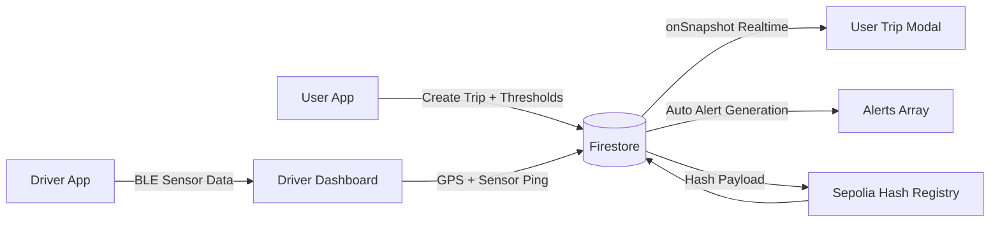

# BLACKBOX INSURANCE PLATFORM

<p align="center">
  
  
  
  
  
</p>

A real-time shipment monitoring system for insurance workflows.

It combines:
- live BLE sensor ingestion from ESP32
- GPS tracking from driver devices
- auto-generated anomaly alerts
- immutable hash anchoring for audit-grade evidence

---

## 1) What This System Does

### Core Idea
A user creates a trip with geofence and threshold rules. A driver runs the trip with BLE + GPS. Data streams to Firestore in real-time. Alerts are generated instantly when conditions are violated.

### Why It Exists
Insurance teams need evidence, not assumptions.
This platform creates a timeline of:
- where shipment was
- what sensors measured
- when anomalies happened
- what was recorded on-chain

---

## 2) Visual System Flow



---

## 3) Feature Matrix

| Domain | Capability |
|---|---|
| Auth | Separate user and driver flows with Firebase Authentication |
| Trip Ops | Create trips with configurable services and thresholds |
| Geofence | Start/end geofence with circle and polygon support |
| Device | ESP32 BLE integration with HMAC payload verification |
| Sensor Stream | Temperature, humidity, acceleration, gyroscope, tamper |
| GPS | Driver location capture with validity guard |
| Alerts | Real-time automatic alerts from incoming tracking data |
| UI Sync | Firestore onSnapshot for live alerts + tracking updates |
| Integrity | Hash anchoring of trip and alert records to Sepolia |

---

## 4) Data Quality Guards Built In

Current behavior includes these safeguards:

- GPS validity gate: invalid/null-island coordinates are filtered before persistence.
- GPS-first streaming: BLE tracking write is gated on valid GPS availability in driver flow.
- Cooldown-based alert throttling: same alert type is not spammed continuously.
- HMAC verification on BLE payload: invalid payloads are dropped.

---

## 5) Tech Stack

- Frontend: React 18, React Router 6, Tailwind utility styling, Leaflet maps
- Realtime + Auth + Storage: Firebase (Firestore + Auth)
- BLE integration: Web Bluetooth API
- Crypto validation: crypto-js (HMAC)
- Blockchain anchoring: ethers.js on Sepolia

---

## 6) Project Structure

```text
BB2/
├─ backend/
│  ├─ .env.example
│  └─ src/
├─ frontend/
│  ├─ arudino_code.ino
│  ├─ package.json
│  ├─ public/
│  ├─ build/
│  └─ src/
│     ├─ components/
│     ├─ contexts/
│     ├─ services/
│     ├─ styles/
│     ├─ lib/
│     ├─ App.js
│     └─ firebase.js
├─ docs/
│  ├─ QUICKSTART.md
│  ├─ SETUP.md
│  ├─ FIREBASE_SETUP.md
│  ├─ API_SCHEMA.md
│  ├─ COMPLETE_REFERENCE.md
│  └─ DRIVER_ASSIGNMENT.md
├─ START_HERE.md
├─ VERIFICATION_CHECKLIST.md
└─ README.md
```

---

## 7) Environment Variables

Configure in frontend environment file.

### Firebase (required)

| Key |
|---|
| REACT_APP_FIREBASE_API_KEY |
| REACT_APP_FIREBASE_AUTH_DOMAIN |
| REACT_APP_FIREBASE_PROJECT_ID |
| REACT_APP_FIREBASE_STORAGE_BUCKET |
| REACT_APP_FIREBASE_MESSAGING_SENDER_ID |
| REACT_APP_FIREBASE_APP_ID |

### BLE + Sensor Integrity (required for device flow)

| Key | Purpose |
|---|---|
| REACT_APP_BLE_SERVICE_UUID | BLE service UUID expected by app |
| REACT_APP_BLE_CHARACTERISTIC_UUID | BLE characteristic UUID expected by app |
| REACT_APP_HMAC_SECRET | Verifies integrity of payloads from ESP32 |

### Blockchain Hash Anchoring (optional but recommended)

| Key | Purpose |
|---|---|
| REACT_APP_SEPOLIA_URL | RPC endpoint |
| REACT_APP_PRIVATE_KEY | Wallet key used for write tx |
| REACT_APP_HASH_REGISTRY_ADDRESS | Smart contract that stores hashes |

If blockchain keys are missing, blockchain service auto-disables and app still runs.

---

## 8) Local Setup

## Prerequisites

- Node.js 14+
- npm 6+
- Firebase project
- Chrome or Edge (for BLE)

## Install and Run

```bash
cd frontend
npm install
npm start
```

App URL:

```text
http://localhost:3000
```

---

## 9) First-Time Firebase Setup (Short)

1. Create Firebase project.
2. Enable Email/Password auth.
3. Create Firestore database.
4. Add web app and copy Firebase config.
5. Put config in frontend env.
6. Start app and sign up test users.

Detailed guides:
- docs/FIREBASE_SETUP.md
- docs/SETUP.md
- docs/QUICKSTART.md

---

## 10) Operational Workflow

## User Path

1. Sign up/login as user.
2. Create trip with:
   - service toggles
   - temperature/humidity thresholds
   - impact sensitivity level
   - start/end geofences
3. Open trip modal to watch live alerts and tracking.

## Driver Path

1. Sign up/login as driver.
2. Select assigned trip.
3. Grant location permission.
4. Connect ESP32 via Bluetooth.
5. Stream live sensor + GPS data.
6. End trip when complete.

## Assignment Path

Trip assignment is typically done through Firestore admin workflow described in docs/DRIVER_ASSIGNMENT.md.

---

## 11) Alert Catalog

These alerts are present in the current flow:

- temperature
- humidity
- Temp Humidity Sensor Fault
- Speed impact
- Heavy rotation
- Impact Sensor Fault
- tamper
- tracking (connection silence/lost ping from driver-side watchdog)

Threshold source:
- trip.alertThresholds.temperatureMax
- trip.alertThresholds.humidityMax
- trip.alertThresholds.impactLevel

---

## 12) Realtime Behavior

The system uses Firestore onSnapshot listeners.

Meaning:
- when tracking data updates, UI updates without page refresh
- when alerts are appended, alert tab updates instantly
- no polling loop required

---

## 13) ESP32 Payload Expectations

Typical payload shape handled by the app:

```json
{
  "data": {
    "temp": 25.5,
    "humidity": 60,
    "tamper": 0,
    "ax": 0.12,
    "ay": -0.05,
    "az": 9.81,
    "gx": 0.01,
    "gy": 0.02,
    "gz": 0.03
  },
  "hmac": "..."
}
```

The app re-computes HMAC over the data object string and rejects mismatches.

---

## 14) Security and Integrity Notes

- BLE payload integrity check with HMAC.
- Firebase Auth for role-based access.
- Trip and alert hashes can be anchored on Sepolia for tamper-evident audit traces.

